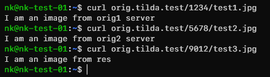

# Тестовое задание №1
Вариант решения тестового задания __"Понимание nginx и upstream-ов"__

## Описание тестового стенда
В соответствии с заданием был выбран виртуальный сервер на базе ОС Debian 11 с хостнеймом `nk-test-01`:

```
Distributor ID: Debian
Description:    Debian GNU/Linux 11 (bullseye)
Release:        11
Codename:       bullseye
```
В файл `/etc/hosts` добавлено соответствие записей для поддоменов с локальным IP-адресом сервера:

```
10.20.20.117 orig1.tilda.test orig2.tilda.test orig.tilda.test res.tilda.test
```
Для имитации распределённой инфраструктуры все домены за прокси были размещены на разных портах:
- orig1.tilda.test: port 8081
- orig2.tilda.test: port 8082
- res.tilda.test:   port 8083

## Настройка порта SSH
Сервер развёрнут с предуставленным ssh-сервером (openssh-server):
```
openssh-server:
  Installed: 1:8.4p1-5+deb11u2
  Candidate: 1:8.4p1-5+deb11u2
  Version table:
 *** 1:8.4p1-5+deb11u2 500
        500 http://deb.debian.org/debian bullseye/main amd64 Packages
        100 /var/lib/dpkg/status
```
Для смены порта, на котором будет работать сервис, требуется изменить/добавить следующую строку в файл конфигурации `/etc/ssh/sshd_config`:
```
Port 33333
```
и перезапустить сервис
```
sudo systemctl restart ssh
```
В логе видно, что сервис запущен на порту 33333:
```
 Server listening on 0.0.0.0 port 33333.
```
Или в списке мониторинга сетевых подключений:
```
nk@nk-test-01:~$ sudo netstat -tlpn | grep ssh
tcp        0      0 0.0.0.0:33333           0.0.0.0:*               LISTEN      21036/sshd: /usr/sb
tcp6       0      0 :::33333                :::*                    LISTEN      21036/sshd: /usr/sb
```

## Подготовка рабочих директорий
Директории для веб-серверов были созданы в `/var/www/`

```
nk@nk-test-01:~$ tree /var/www/
/var/www/
├── apache
│   ├── orig1
│   │   ├── 1234
│   │   │   └── test1.jpg
│   │   └── index.html
│   └── orig2
│       ├── 5678
│       │   └── test2.jpg
│       └── index.html
└── nginx
    └── res
        ├── 9012
        │   └── test3.jpg
        └── index.php
```
Содержимое файлов и структура каталогов отображена в директории [www](www) в данном репозитории. Пользователь и группа для каталогов [apache](www/apache) и [nginx](www/nginx) и их содержимого установлен `www-data`:
```
nk@nk-test-01:~$ sudo ls -la /var/www/
total 16
drwxr-xr-x  4 root     root     4096 Dec 16 15:29 .
drwxr-xr-x 12 root     root     4096 Dec 16 10:41 ..
drwxr-x---  4 www-data www-data 4096 Dec 16 11:14 apache
drwxr-x---  3 www-data www-data 4096 Dec 16 13:58 nginx
```

## Apache

Установка веб-сервера apache была произведена из стандартного репозитория дистрибутива:
```
apache2:
  Installed: 2.4.56-1~deb11u2
  Candidate: 2.4.56-1~deb11u2
  Version table:
 *** 2.4.56-1~deb11u2 500
        500 http://deb.debian.org/debian bullseye/main amd64 Packages
        100 /var/lib/dpkg/status
     2.4.56-1~deb11u1 500
        500 http://security.debian.org/debian-security bullseye-security/main amd64 Packages
```
Так как было принято решение разместить домены на разных портах, в конфигурацию apache были добавлены соответствующие инструкции в файле `/etc/apache2/ports.conf`:
```
Listen 8081
Listen 8082
```
Для работы виртуальных хостов были созданы простейшие конфигурации [orig1.conf](orig1.conf) и [orig2.conf](orig2.conf) в директории `/etc/apache2/sites-available/`, после чего активированы (добавлены симлинки в `/etc/apache2/sites-enabled/`) командой `sudo a2ensite orig1.conf orig2.conf`. Конфигурация проверена командой `sudo apache2ctl configtest`:
```
Syntax OK
```
Для применения конфигурации `sudo systemctl reload apache2`.

Проверка корректности настройки:
```
nk@nk-test-01:~$ curl orig1.tilda.test:8081
<html>
    <body>
        <h3>Orig1 default page</h3>
    </body>
</html>
nk@nk-test-01:~$ curl orig2.tilda.test:8082
<html>
    <body>
        <h3>Orig2 default page</h3>
    </body>
</html>
```
## PHP-FPM
Аналогично установлен сервис php-fpm из репозитория дистрибутива, доступна версия только 7.4, что достаточно для выполнения запросов из тестового задания:
```
php-fpm:
  Installed: 2:7.4+76
  Candidate: 2:7.4+76
  Version table:
 *** 2:7.4+76 500
        500 http://deb.debian.org/debian bullseye/main amd64 Packages
        100 /var/lib/dpkg/status
```
Дополнительная конфигурация не производилась. Пользователь для сервиса по умолчанию в конфигурации `www.conf` установлен аналогичным, как и для apache - `www-data`.

## Nginx

Веб-сервер nginx установлен в соответствии с [официальной документацией](https://docs.nginx.com/nginx/admin-guide/installing-nginx/installing-nginx-open-source/#installing-prebuilt-debian-packages):

```
nk@nk-test-01:~$ sudo apt-cache policy nginx
nginx:
  Installed: 1.24.0-1~bullseye
  Candidate: 1.24.0-1~bullseye
  Version table:
 *** 1.24.0-1~bullseye 900
        900 http://nginx.org/packages/debian bullseye/nginx amd64 Packages
        100 /var/lib/dpkg/status
```

В стандартной установке файлы конфигураций читаются из директории `/etc/nginx/conf.d/`, куда и были добавлены конфигурации для поддоменов [orig](orig.conf) и [res](res.conf). Также в основном конфигурационном файле был изменён пользователь, от которого работает сервис nginx на `wwww-data`:

```
user  www-data;
```
В конфигурации основого поддомена `orig.tilda.test` созданы три `upstream` для маршрутизации запросов на соответствубщие поддомены.

 В соответствии с заданием, при запросе первым должен обработать запрос сервер с `orig1.tilda.test`. Для этого создан `location /`, который проксирует запрос на `upstream orig1`. Если данный файл не найден, происходит кастомная обработка ответа 404 при помощи директивы [error_page](https://nginx.org/en/docs/http/ngx_http_core_module.html#error_page). Также, чтобы данная директива сработала и ошибка обрабатывалась на уровне прокси, а не клиента, включена опция [proxy_intercept_errors](https://nginx.org/en/docs/http/ngx_http_proxy_module.html#proxy_intercept_errors). В данном случае при возврате ошибки 404 будет вызван `named location` с именем `@orig2`, где аналогичным образом происходит запрос на `upstream orig2`.

 В случае, если второй запрос тоже вернул ошибку 404, будет обработан последний `location @res`, в котором запрос будет передан на виртуальный хост `res.tilda.test:8083`, который обслуживается локальным nginx сервером. 

 В виртуальном хосте для `res.tilda.test:8083` создана базовая конфигурация для работы с менеджером php-fpm. При запросе на данный хост будет вызван файл `index.php` в корневой директории (`root`) для данного виртуального хоста (`/var/www/nginx/res`) и ему будет переданы аргументы и параметры из запроса, благодаря опциям `$is_args$args`. 
 
 Проверим конфигурацию сервиса и применим её:
 ```
nk@nk-test-01:~$ sudo nginx -t
nginx: the configuration file /etc/nginx/nginx.conf syntax is ok
nginx: configuration file /etc/nginx/nginx.conf test is successful
nk@nk-test-01:~$ sudo nginx -s reload
 ```
## Проверка


Для проверки выполним запросы из задания и убедимся, что вызываются корректные файлы:

```
nk@nk-test-01:~$ curl orig.tilda.test/1234/test1.jpg
I am an image from orig1 server
nk@nk-test-01:~$ curl orig.tilda.test/5678/test2.jpg
I am an image from orig2 server
nk@nk-test-01:~$ curl orig.tilda.test/9012/test3.jpg
I am an image from res
```

В соответствии с заданием и структурой файлов можно сделать вывод, что веб-серверы и прокси настроены правильно, запросы отдаются без ошибок. 